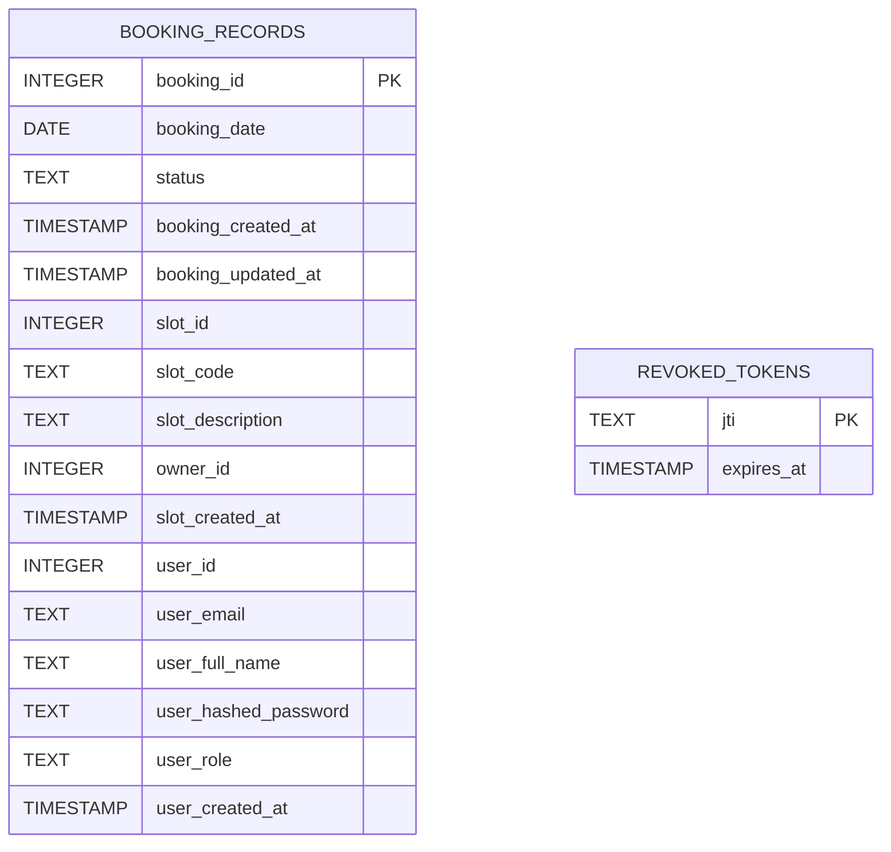
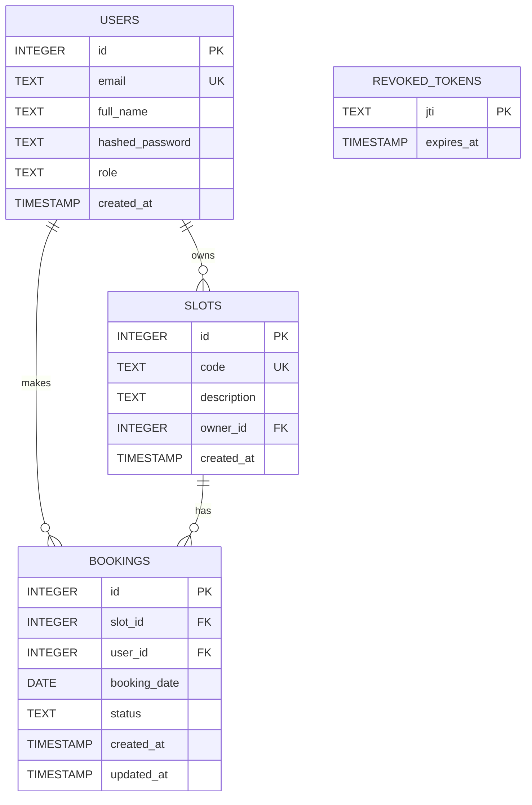

## Проект - MVP «Сервис бронирования парковочных мест»

## Кому нужна разрабатываемая программа, как она будет использоваться
............
## Функциональные требования
............

## Предварительная схема БД



## Текстовые ограничения, вытекающие из функциональных требований

- **Каждый пользователь** имеет ровно один email, имя, пароль и роль
- **Один пользователь** может владеть нулём или более слотов
- **Каждый слот** имеет ровно одного владельца
- **Один слот** может иметь ноль или более бронирований
- **Каждое бронирование** относится ровно к одному пользователю и ровно к одному слоту
- **Для одного слота на одну дату** может существовать не более одного бронирования
- **Один пользователь** может иметь ноль или более бронирований
- **Каждый отозванный токен** определяется уникальным jti и имеет один срок действия

## Представление текстовых ограничений в виде функциональных зависимостей (FD)

**users**
- `id → email, full_name, hashed_password, role, created_at`
- `email → id, full_name, hashed_password, role, created_at`

**slots**
- `id → code, description, owner_id, created_at`
- `code → id, description, owner_id, created_at`

**bookings**
- `id → slot_id, user_id, booking_date, status, created_at, updated_at`
- `(slot_id, booking_date) → user_id, status` (ограничение «один слот - одно бронирование на дату»)

**revoked_tokens**
- `jti → expires_at`

## Представление текстовых ограничений в виде многозначных зависимостей (MVD)

- `user_id ↠ slot_id` (пользователь может владеть несколькими слотами)
- `user_id ↠ booking_id` (пользователь может иметь несколько бронирований)
- `slot_id ↠ booking_id` (у одного слота может быть несколько бронирований в разные даты)

## Нормализация предварительной схемы относительно множества зависимостей

### 1. Исходные данные: атрибуты и зависимости

Система реализует хранение пользователей, слотов, бронирований и отозванных токенов. На предварительном этапе проектирования данные могли быть представлены в виде одного универсального отношения, объединяющего информацию о сущностях:

```
R(
user_id, email, full_name, hashed_password, role, user_created_at,
slot_id, slot_code, slot_description, owner_id, slot_created_at,
booking_id, booking_date, status, booking_created_at, booking_updated_at
)
```

Также есть независимая сущность токенов:

**T**(jti, expires_at)

Из функциональных требований и ограничений следуют ограничения и соответствующие им зависимости.

#### 1.1. Функциональные зависимости (FD)

**Users:**

* `id → email, full_name, hashed_password, role, created_at`
* `email → id, full_name, hashed_password, role, created_at`
  (т.к. email уникален)

**Slots:**

* `id → code, description, owner_id, created_at`
* `code → id, description, owner_id, created_at`
  (т.к. code уникален)

**Bookings:**

* `id → slot_id, user_id, booking_date, status, created_at, updated_at`
* `(slot_id, booking_date) → user_id, status`
  (т.к. по ограничению “для одного слота на одну дату не более одного бронирования” пара `(slot_id, booking_date)` однозначно определяет пользователя и статус брони)

**Revoked_tokens:**

* `jti → expires_at`

#### 1.2. Многозначные зависимости (MVD) по смыслу предметной области

Из требований “у пользователя может быть несколько слотов и несколько бронирований; у слота может быть несколько бронирований” следуют многозначные зависимости (в терминах универсального отношения R):

* `user_id ↠ slot_id`
* `user_id ↠ booking_id`
* `slot_id ↠ booking_id`

---

### 2. Почему требуется нормализация: аномалии в универсальном отношении

Если хранить данные в одной таблице R, возникают типовые аномалии обновления/удаления:

* **Аномалия обновления:** изменение имени пользователя (`full_name`) потребует обновлять множество строк (все строки, где встречается данный user_id в контексте бронирований/слотов). Ошибка обновления части строк приводит к противоречивым данным.
* **Аномалия удаления:** удаление единственного бронирования пользователя может привести к потере его данных (email/имя), если эти данные хранятся только в R.
* **Аномалия вставки:** чтобы добавить слот без бронирования (или пользователя без бронирования), пришлось бы вставлять “пустые” значения для части атрибутов, что ведёт к NULL-аномалиям и несогласованности.

Следовательно, требуется декомпозиция R на отношения, устраняющие транзитивные/частичные зависимости и многозначные зависимости, т.е. нормализация относительно заданного множества FD/MVD.

---

### 3. Приведение к 1НФ

В 1НФ все атрибуты атомарны (email, code, booking_date и т.д. - скалярные значения; повторяющихся групп внутри одного поля нет). Следовательно, R удовлетворяет 1НФ.

---

### 4. Приведение ко 2НФ: устранение частичных зависимостей

В универсальном отношении R естественным кандидатным ключом для строк бронирования может выступать:

* `booking_id` (если используется суррогатный ключ), либо
* `(slot_id, booking_date)` (по бизнес-ограничению уникальности брони на слот+дату).

Если рассматривать ключ `(slot_id, booking_date)`, то в R возникают частичные зависимости:

* `slot_id → slot_code, slot_description, owner_id, slot_created_at`
* `user_id → email, full_name, hashed_password, role, user_created_at`

Т.е. часть неключевых атрибутов зависит только от части составного ключа или от неключевых атрибутов (через транзитивность), что является нарушением 2НФ/3НФ. Для устранения выполняем декомпозицию по смысловым сущностям и их детерминантам:

Получаем отношения:

* **USERS**(id, email, full_name, hashed_password, role, created_at)
* **SLOTS**(id, code, description, owner_id, created_at)
* **BOOKINGS**(id, slot_id, user_id, booking_date, status, created_at, updated_at)

Отношение токенов **T** также выделяется отдельно:

* **REVOKED_TOKENS**(jti, expires_at)

После декомпозиции атрибуты пользователя не дублируются в строках слотов/бронирований, а атрибуты слота не дублируются в строках бронирований → устраняются основные аномалии обновления/удаления.

---

### 5. Проверка 3НФ / BCNF для полученных отношений (устранение транзитивных зависимостей)

Далее проверим каждое полученное отношение на соответствие BCNF (усиленная форма 3НФ):
**для любой нетривиальной FD X → Y детерминант X должен быть суперключом отношения.**

#### 5.1. USERS

FD:

* `id → email, full_name, hashed_password, role, created_at`
* `email → id, full_name, hashed_password, role, created_at`

Ключи:

* `{id}` - первичный ключ
* `{email}` - альтернативный ключ (уникален)

Обе левые части FD являются ключами → USERS находится в **BCNF**.

#### 5.2. SLOTS

FD:

* `id → code, description, owner_id, created_at`
* `code → id, description, owner_id, created_at`

Ключи:

* `{id}` - первичный ключ
* `{code}` - альтернативный ключ (уникален)

Обе левые части FD являются ключами → SLOTS находится в **BCNF**.

#### 5.3. BOOKINGS

FD:

* `id → slot_id, user_id, booking_date, status, created_at, updated_at`
* `(slot_id, booking_date) → user_id, status`

Ключи:

* `{id}` - первичный ключ
* `{slot_id, booking_date}` - альтернативный ключ **при условии реализации ограничения уникальности** “не более одного бронирования на слот + дату”.

Тогда левые части FD (`id` и `(slot_id, booking_date)`) являются суперключами → BOOKINGS находится в **BCNF**.

Важно: чтобы это было обеспечено на уровне БД, в DDL для `bookings` необходимо задать `UNIQUE(slot_id, booking_date)` при создании таблицы.

#### 5.4. REVOKED_TOKENS

FD:

* `jti → expires_at`

Ключ:

* `{jti}` - первичный ключ

Левая часть FD является ключом → REVOKED_TOKENS находится в **BCNF**.

---

### 6. Учет многозначных зависимостей (4НФ)

В универсальном отношении R смысловые MVD вида `user_id ↠ slot_id`, `user_id ↠ booking_id`, `slot_id ↠ booking_id` означают “у пользователя/слота есть независимые множества связанных сущностей”. Хранение этих множеств в одном отношении приводит к избыточности и аномалиям (например, декартовым “размножениям” комбинаций слотов и бронирований).

В полученной схеме эти многозначные зависимости реализованы корректно через отдельные отношения и внешние ключи:

* множество слотов пользователя хранится в **SLOTS(owner_id → users.id)**,
* множество бронирований хранится в **BOOKINGS(slot_id → slots.id, user_id → users.id)**.

Таким образом, нет необходимости хранить независимые многозначные наборы в одной таблице; схема устраняет соответствующие аномалии и удовлетворяет требованиям **4НФ** по смыслу (нет нетривиальных MVD внутри одной таблицы, которые не определяются ключом).

---

### 7. Итог нормализации и вывод об устранении аномалий

После нормализации универсального отношения R относительно заданного множества FD/MVD получена схема отношений:

* USERS(id, email, full_name, hashed_password, role, created_at)
* SLOTS(id, code, description, owner_id, created_at)
* BOOKINGS(id, slot_id, user_id, booking_date, status, created_at, updated_at) + `UNIQUE(slot_id, booking_date)`
* REVOKED_TOKENS(jti, expires_at)

Эта схема:

* устраняет дублирование данных пользователя и слота в бронированиях,
* устраняет аномалии обновления (изменения имени/почты/описания слота делаются в одном месте),
* устраняет аномалии удаления (удаление бронирования не уничтожает сущность пользователя/слота),
* соответствует BCNF (при наличии уникальности `(slot_id, booking_date)`) и не содержит проблемных многозначных зависимостей в одном отношении.


## Итоговая схема


## SQL код схемы

```sql
CREATE TABLE IF NOT EXISTS users (
  id INTEGER PRIMARY KEY AUTOINCREMENT,
  email TEXT NOT NULL UNIQUE,
  full_name TEXT NOT NULL,
  hashed_password TEXT NOT NULL,
  role TEXT NOT NULL DEFAULT 'user',
  created_at TIMESTAMP DEFAULT CURRENT_TIMESTAMP
);

CREATE TABLE IF NOT EXISTS slots (
  id INTEGER PRIMARY KEY AUTOINCREMENT,
  code TEXT NOT NULL UNIQUE,
  description TEXT,
  owner_id INTEGER NOT NULL,
  created_at TIMESTAMP DEFAULT CURRENT_TIMESTAMP,
  FOREIGN KEY(owner_id) REFERENCES users(id) ON DELETE CASCADE
);

CREATE TABLE IF NOT EXISTS bookings (
  id INTEGER PRIMARY KEY AUTOINCREMENT,
  slot_id INTEGER NOT NULL,
  user_id INTEGER NOT NULL,
  booking_date DATE NOT NULL,
  status TEXT NOT NULL DEFAULT 'pending',
  created_at TIMESTAMP DEFAULT CURRENT_TIMESTAMP,
  updated_at TIMESTAMP DEFAULT CURRENT_TIMESTAMP,
  FOREIGN KEY(slot_id) REFERENCES slots(id) ON DELETE CASCADE,
  FOREIGN KEY(user_id) REFERENCES users(id) ON DELETE CASCADE,
  UNIQUE(slot_id, booking_date)
);

CREATE TABLE IF NOT EXISTS revoked_tokens (
  jti TEXT PRIMARY KEY,
  expires_at TIMESTAMP NOT NULL
);
```

## Написание SQL DML-запросов, реализующих функциональные требования

### 1. Пользователи

**Q1. Регистрация пользователя**

```sql
INSERT INTO users (email, full_name, hashed_password, role)
VALUES (:email, :full_name, :hashed_password, COALESCE(:role, 'user'));
```

**Q2. Получение пользователя по email (логин)**

```sql
SELECT id, email, full_name, hashed_password, role, created_at
FROM users
WHERE email = :email;
```

---

### 2. Слоты

**Q3. Создание слота владельцем**

```sql
INSERT INTO slots (code, description, owner_id)
VALUES (:code, :description, :owner_id);
```

**Q4. Получить список слотов владельца**

```sql
SELECT id, code, description, created_at
FROM slots
WHERE owner_id = :owner_id
ORDER BY created_at DESC;
```

**Q5. Получить список всех слотов**

```sql
SELECT s.id, s.code, s.description, s.owner_id, u.full_name AS owner_name
FROM slots s
JOIN users u ON u.id = s.owner_id
ORDER BY s.created_at DESC;
```

---

### 3. Бронирования

**Q6. Проверка, свободен ли слот на дату**

```sql
SELECT 1
FROM bookings
WHERE slot_id = :slot_id
  AND booking_date = :booking_date
LIMIT 1;
```

**Q7. Создать бронирование**

```sql
INSERT INTO bookings (slot_id, user_id, booking_date, status)
VALUES (:slot_id, :user_id, :booking_date, 'pending');
```

**Q8. Список бронирований пользователя**

```sql
SELECT b.id, b.booking_date, b.status, b.created_at, b.updated_at,
       s.code AS slot_code, s.description
FROM bookings b
JOIN slots s ON s.id = b.slot_id
WHERE b.user_id = :user_id
ORDER BY b.booking_date DESC, b.created_at DESC;
```

**Q9. Список бронирований по слотам владельца**

```sql
SELECT b.id, b.booking_date, b.status, b.created_at, b.updated_at,
       s.code AS slot_code,
       u.id AS booked_user_id, u.email AS booked_user_email, u.full_name AS booked_user_name
FROM bookings b
JOIN slots s ON s.id = b.slot_id
JOIN users u ON u.id = b.user_id
WHERE s.owner_id = :owner_id
ORDER BY b.booking_date DESC, b.created_at DESC;
```

**Q10. Изменить статус бронирования (подтвердить/отклонить) владельцем**

```sql
UPDATE bookings
SET status = :new_status,
    updated_at = CURRENT_TIMESTAMP
WHERE id = :booking_id
  AND EXISTS (
    SELECT 1
    FROM slots s
    WHERE s.id = bookings.slot_id
      AND s.owner_id = :owner_id
  );
```

**Q11. Отмена бронирования пользователем**

```sql
UPDATE bookings
SET status = 'cancelled',
    updated_at = CURRENT_TIMESTAMP
WHERE id = :booking_id
  AND user_id = :user_id;
```

---

### 4. Отозванные токены

**Q12. Отозвать токен (logout / инвалидация refresh/access)** 

```sql
INSERT INTO revoked_tokens (jti, expires_at)
VALUES (:jti, :expires_at);
```

**Q13. Проверить, что токен отозван и ещё не истёк**

```sql
SELECT 1
FROM revoked_tokens
WHERE jti = :jti
  AND expires_at > CURRENT_TIMESTAMP
LIMIT 1;
```

**Q14. Очистить просроченные записи**

```sql
DELETE FROM revoked_tokens
WHERE expires_at <= CURRENT_TIMESTAMP;
```

---

## Группировка запросов в транзакции

### Транзакция T1: регистрация пользователя

```sql
BEGIN;
  INSERT INTO users (email, full_name, hashed_password, role)
  VALUES (:email, :full_name, :hashed_password, 'user');
COMMIT;
-- при ошибке UNIQUE(email) -> ROLLBACK (делает приложение)
```

---

### Транзакция T2: создание слота

```sql
BEGIN;
  INSERT INTO slots (code, description, owner_id)
  VALUES (:code, :description, :owner_id);
COMMIT;
```

---

### Транзакция T3: создание бронирования

```sql
BEGIN IMMEDIATE;

  -- Проверяем занятость
  SELECT 1
  FROM bookings
  WHERE slot_id = :slot_id AND booking_date = :booking_date
  LIMIT 1;

  -- если нашли строку -> ROLLBACK и возвращаем "занято"

  -- Создаём бронирование
  INSERT INTO bookings (slot_id, user_id, booking_date, status)
  VALUES (:slot_id, :user_id, :booking_date, 'pending');

COMMIT;
```

---

### Транзакция T4: изменение статуса владельцем

```sql
BEGIN;

  UPDATE bookings
  SET status = :new_status,
      updated_at = CURRENT_TIMESTAMP
  WHERE id = :booking_id
    AND EXISTS (
      SELECT 1
      FROM slots s
      WHERE s.id = bookings.slot_id
        AND s.owner_id = :owner_id
    );

  -- приложение проверяет changes():
  -- если changes() = 0 -> либо booking_id не существует, либо это не слот владельца

COMMIT;
```

---

### Транзакция T5: logout / отзыв токена

```sql
BEGIN;
  INSERT INTO revoked_tokens (jti, expires_at)
  VALUES (:jti, :expires_at);
COMMIT;
```

## Результат выполнения примеров запросов
### Выполняется при помощи файла scripts/check_queries.py и db/schema.sql

---

## Оформленного интверфейса нет, но в MVP есть доступ к SWAGGER через эндпоинт /docs, в котором доступны все функции приложения

