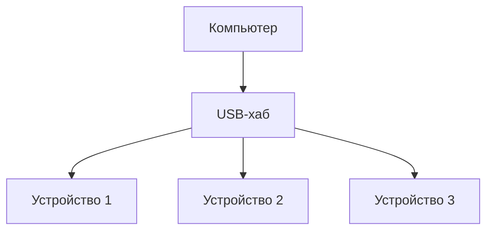
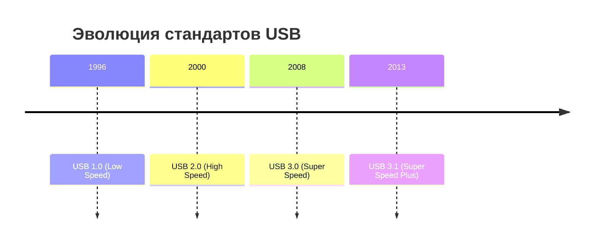
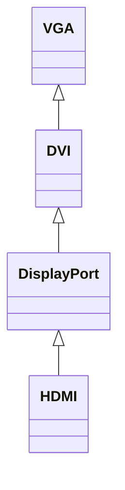
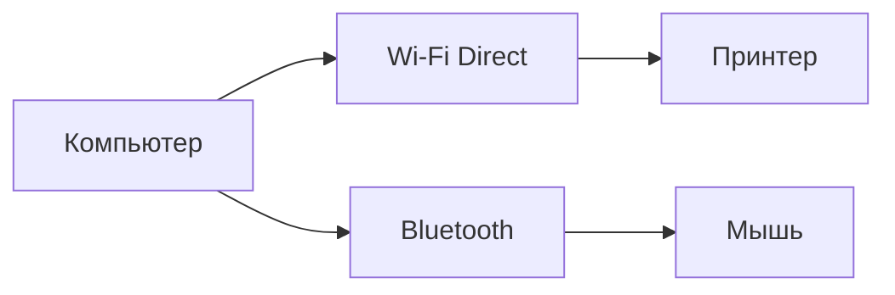

# Подключение внешних устройств к компьютеру

## Введение

Внешние устройства подключаются к компьютеру через порты. Для подключения устройств необходимо разбираться в типах портов и разъёмов.

## Стандарты подключения

### USB

**USB (Universal Serial Bus)** — универсальная последовательная шина, предназначенная для подключения периферийных устройств к компьютеру.

* Шина означает, что данные передаются по одному проводу.
* Последовательная передача данных означает, что биты передаются один за другим.

#### USB-хабы

USB-хабы (разветвители) используются для подключения нескольких устройств к одному USB-порту на компьютере.

*USB-хаб позволяет подключить несколько устройств к одному порту компьютера.*

/000040s_top_4.jpg)

#### Версии USB

* **Low Speed** и **Full Speed** — ранние версии USB.
* **USB 2.0 (High Speed)** — позволяет передавать данные со скоростью около 480 Мбит/с.
* **USB 3.0 (Super Speed)** — передаёт данные со скоростью 5 Гбит/с.
* **USB Super Speed Plus** — более поздние версии USB.

*Хронология развития стандартов USB, начиная с 1996 года.*

#### Цветовое обозначение портов

Многие производители используют цветовое обозначение портов для USB разных версий:

* USB 3.0 обозначается синим цветом.
* USB 2.0 обозначается чёрным цветом.
* Есть также жёлтые и красные порты.

### Питание устройств через USB

USB позволяет передавать электрическую мощность до 100 Вт. Современные USB-порты повышают напряжение до 20 В для передачи большей мощности.

*USB-порт обеспечивает питание подключённых устройств.*

/000339s_top_2.jpg)

## Старые типы портов

### Порты для подключения мониторов

* **VGA** — старый стандарт.
* **DVI** и **DisplayPort** — более современные цифровые стандарты.
* **HDMI** — стандарт, который пришёл из мира бытовой техники.

*Иерархия стандартов подключения мониторов, начиная с устаревшего VGA.*

### Адаптеры

Адаптеры — это устройства-переводчики, которые декодируют сигнал из одного стандарта и преобразуют его в другой стандарт.

## Оптические разъёмы

В оптических разъёмах биты информации кодируются световыми импульсами. Вместо проводов используется тонкое волокно из стекла.

*Оптические разъёмы передают данные с помощью световых импульсов через оптическое волокно.*

/000578s_top_7.jpg)

## Беспроводные подключения

Появляется всё больше устройств, которые подключаются без проводов, например, по радиосигналу. Примеры таких устройств:

* Смартфоны, которые могут печатать документы на принтере через Wi-Fi Direct или E-Link.
* Устройства, которые подключаются к компьютеру по Bluetooth.

*Беспроводные технологии позволяют подключать устройства без использования проводов.*