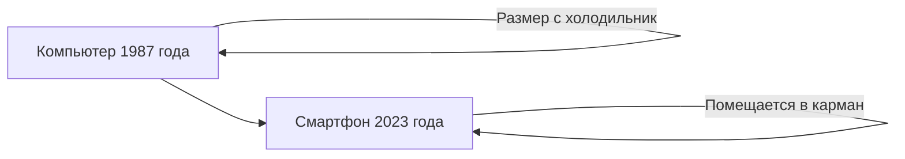
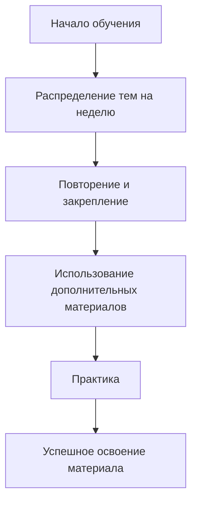

# Введение в цифровую грамотность

## Цель курса

Первый модуль курса по цифровой грамотности направлен на знакомство с новыми информационными технологиями (IT).

### Важность изучения IT

Понимание принципов работы информационных технологий помогает решать часто возникающие проблемы и быть готовым к использованию медленно стареющих информационных технологий в будущем.

## Сравнение современных и устаревших технологий

* **Эволюция устройств:** смартфон помещается в кармане, а компьютер 1987 года был размером с холодильник. /000070s_top_2.jpg)
* **Протоколы и системы:** протокол TCP/IP, созданный 50 лет назад, до сих пор используется для загрузки контента из интернета.
* **Хранение данных:** информация на старом компьютере хранилась на жёстком диске размером с микроволновку, а в современном смартфоне — на чипе размером с монету.
* **Клавиатура:** клавиши на современной клавиатуре практически не изменились с первого персонального компьютера IBM PC. /000120s_top_3.jpg)

### Перспективы развития технологий

Через 10 лет ваш смартфон устареет, но знания, полученные на этом курсе, останутся актуальными. /000139s_top_10.jpg) Вы встретите каталоги файлов, веб-сайты, электронную почту и другие медленно стареющие информационные технологии.

## Советы по эффективному обучению

1. **Распределение тем на неделю:** не пытайтесь изучить все видео за один присест. Дайте информации время, чтобы усвоиться.
2. **Повторение и закрепление:** если вы что-то не поняли, прокрутите видео назад и прослушайте ещё раз.
3. **Использование дополнительных материалов:** в этом модуле многие темы снабжены дополнительными материалами, которые помогут лучше понять тему.
4. **Практика:** ежедневные занятия помогут быстрее освоить компьютерные программы.

### Требования к студентам

Предполагается, что у студентов уже есть базовые навыки работы на компьютере. Если вы никогда раньше не работали на компьютере, ежедневная практика будет необходима для освоения материала. /000259s_top_6.jpg)

## Сравнительная таблица: Современные vs Устаревшие технологии

| Характеристика          | Современные технологии       | Устаревшие технологии         |
|-------------------------|------------------------------|-------------------------------|
| **Размер устройства**   | Смартфон (помещается в карман)| Компьютер (размер с холодильник) |
| **Хранение данных**     | Чип (размер с монету)        | Жёсткий диск (размер с микроволновку) |
| **Клавиатура**          | Практически не изменилась    | Первый IBM PC                 |

## Диаграмма: Эволюция устройств

*Диаграмма иллюстрирует эволюцию устройств от громоздких компьютеров до компактных смартфонов.*

## Диаграмма: Процесс обучения

*Диаграмма показывает последовательность шагов для эффективного обучения.*