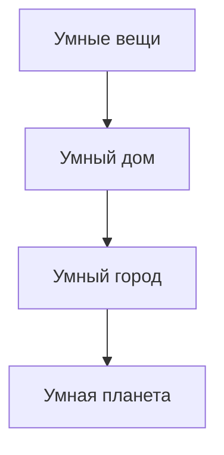
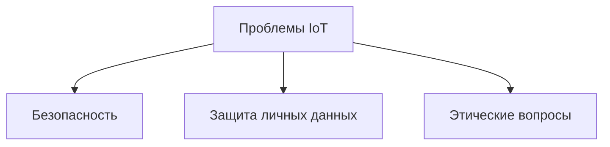

# Интернет вещей: концепция и этапы развития

## Введение

**Интернет вещей (IoT)** — это концепция, объединяющая физические устройства с возможностью подключения к сети для обмена данными и взаимодействия друг с другом.

В 1999 году Кеван Эшсон из MIT представил идею, как внедрение технологий может оптимизировать логистические цепи. Это стало отправной точкой для зарождения концепции интернета вещей.

## Основные принципы

* Умные устройства анализируют окружающую действительность и принимают решения на основе полученной информации.
* Взаимодействие между устройствами позволяет создавать сложные системы, такие как умный дом или умный город.

Примеры умных устройств:

* **Умная кофеварка:** самостоятельно включается и готовит кофе в определённое время. /000100s_top_2.jpg)
* **Умный холодильник:** ведёт учёт продуктов и может заказывать их в онлайн-магазине. /000110s_top_9.jpg)

## Этапы развития

По мнению теоретика Роба из Анкранонбурга, концепция интернета вещей пройдёт четыре этапа развития:

**Пояснение:** Развитие интернета вещей начинается с отдельных устройств и постепенно переходит к глобальным системам.

1. **Умные вещи:** появление отдельных умных устройств, таких как часы или кофеварки. /000249s_top_5.jpg)
2. **Умный дом:** объединение умных устройств в рамках одного жилища.
3. **Умный город:** создание системы, объединяющей умные устройства в масштабах города.
4. **Умная планета:** глобальная система датчиков для мониторинга состояния окружающей среды. /000408s_top_1.jpg)

## Проблемы и вызовы

Основные проблемы, связанные с развитием интернета вещей:

**Пояснение:** Проблемы интернета вещей охватывают безопасность, конфиденциальность и этику.

* **Безопасность:** риск взлома умных устройств и кражи личных данных. /000448s_top_4.jpg)
* **Защита личных данных:** необходимость обеспечения конфиденциальности информации, собираемой умными устройствами.
* **Этические вопросы:** влияние интернета вещей на общество и окружающую среду.

## Заключение

Интернет вещей имеет потенциал для создания более удобных и эффективных систем, но также представляет определённые риски и вызовы. В будущем предстоит решить множество проблем, связанных с безопасностью и этическими аспектами использования умных устройств. /000528s_top_7.jpg)