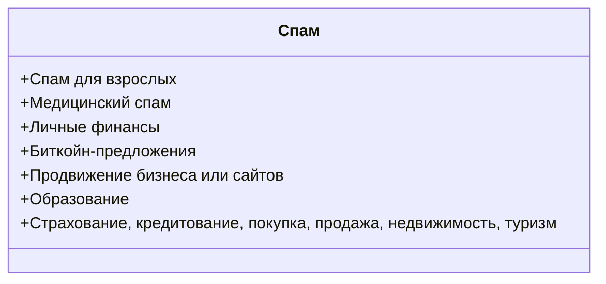
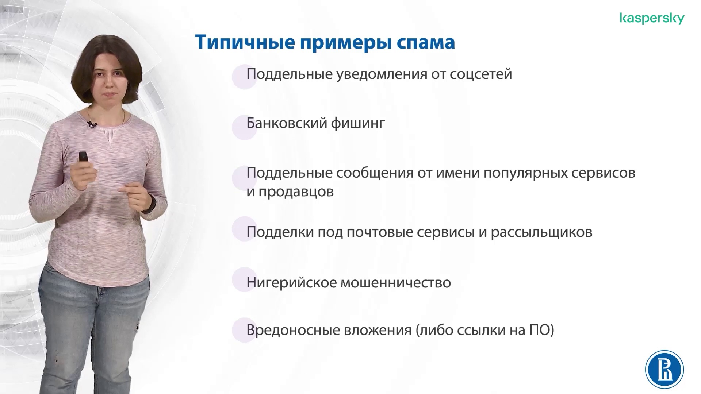
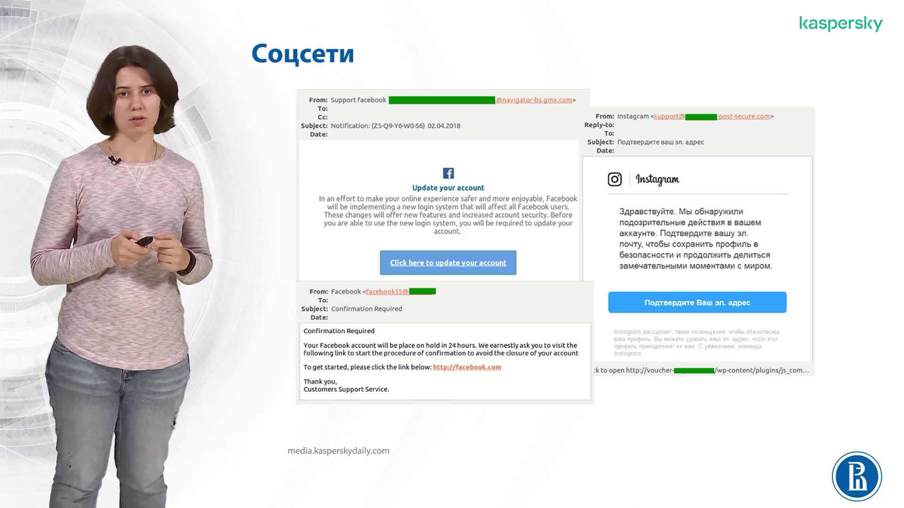
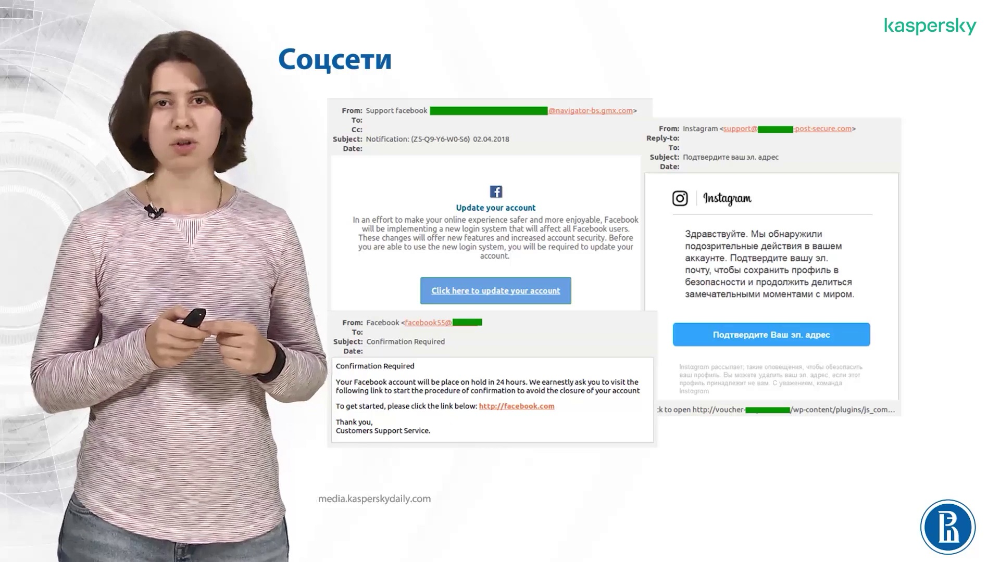
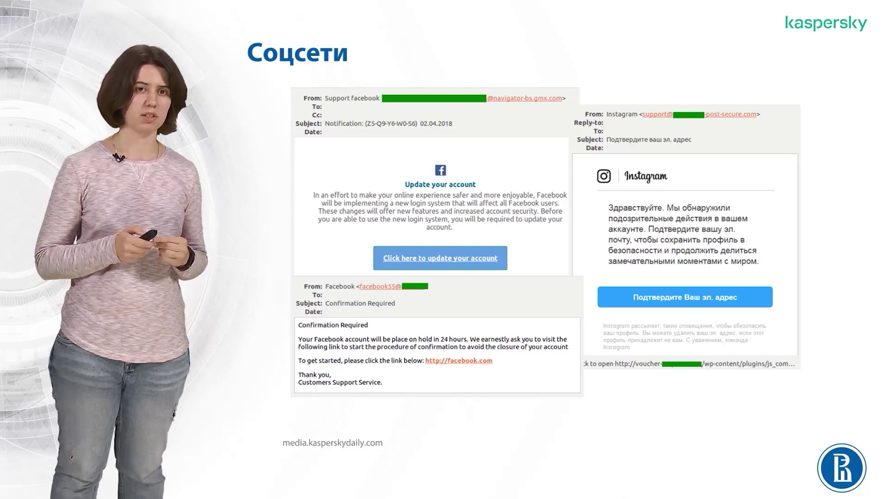
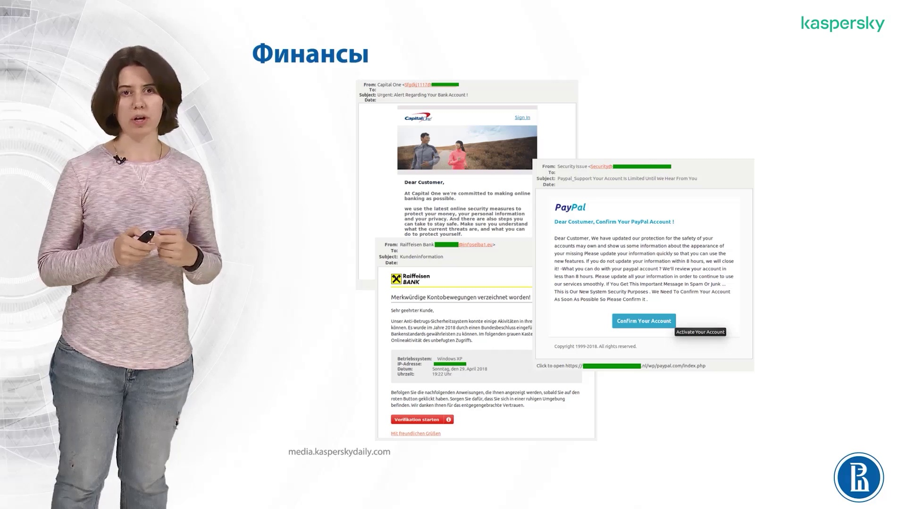
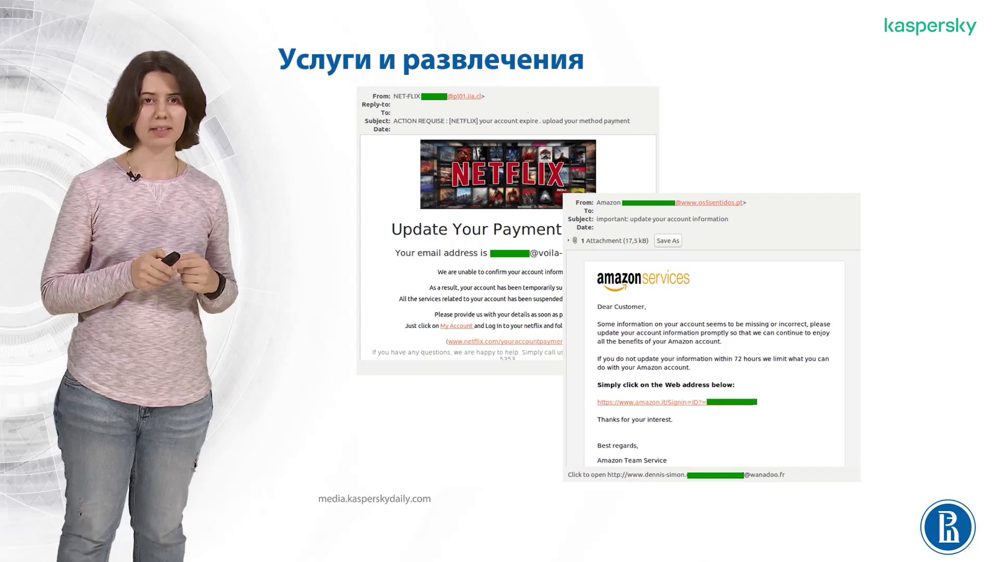
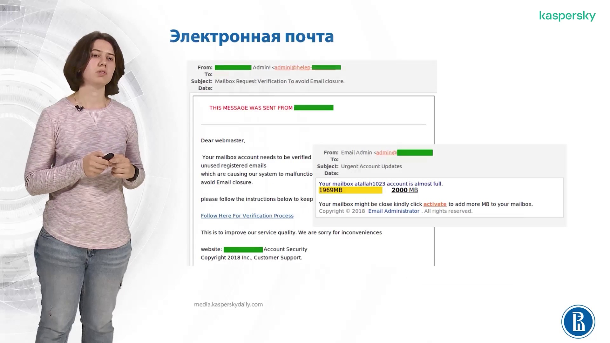
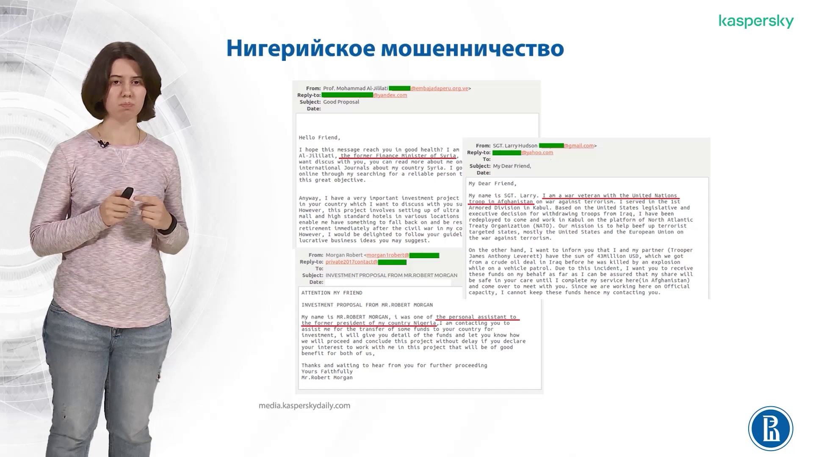
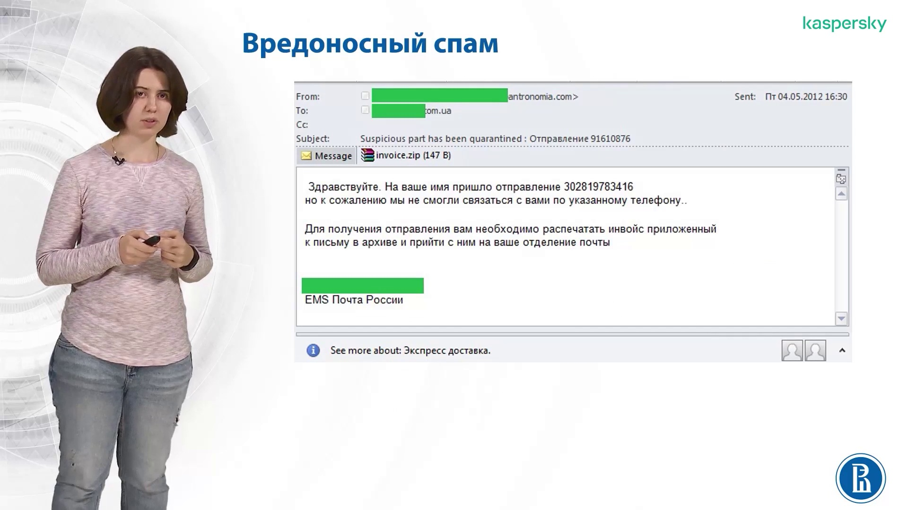

# Виды спама и методы его распространения

## Определение спама

**Спам** — это, как правило, реклама товаров или услуг, а также мошенничество, направленное на кражу личных данных пользователя (*фишинг*).

## Классификация спама по тематике

Спам можно классифицировать по тематике на несколько основных категорий. Ниже представлена диаграмма, иллюстрирующая основные виды спама:

1. **Спам для взрослых**: реклама ресурсов пронографического характера или сайтов знакомств для взрослых, как правило, мошенническая.   
2. **Медицинский спам**: реклама препаратов для увеличения мужской силы, похудения и прочей фармацевтики.  
3. **Личные финансы**: обещания быстрого и крупного заработка в сети, как правило, развод.  
4. **Биткойн-предложения**: предложения, связанные с криптовалютами.  
5. **Продвижение бизнеса или сайтов**: предложения по продвижению бизнеса или сайтов.  
6. **Образование**: реклама курсов, тренингов, обучения и дипломов.  
7. **Страхование, кредитование, покупка, продажа, недвижимость, туризм**: реклама в этих областях, характерная для иностранного сегмента интернета.

## Примеры подделок

### Поддельные уведомления от соцсетей

  

- **Домены**: домены в поле «From» обычно не имеют отношения к сервисам, от имени которых приходят сообщения.  
- **Ссылки**: ссылки обычно ведут на сторонние ресурсы и не связаны с сервисами, от имени которых приходят уведомления.  

Основная задача таких подделок — фишинг, получение личных данных пользователя. 

### Финансовые уведомления

Поддельные уведомления от банков и популярных платёжных систем.   

Основная задача — фишинг финансовых данных пользователя, таких как банковские карты и счета.

### Уведомления от сервисов услуг и развлечений

Как правило, это популярные во всём мире сервисы.   

Мошенники делают ставку на то, что получатели являются клиентами этих сервисов и поверят в подлинность сообщений.

### Подделки под уведомления от почтовых рассылщиков

В сообщении говорится о том, что электронный ящик превысил допустимый размер, и для его увеличения нужно перейти по ссылке из письма. 

### Нигерийское мошенничество

Один из самых старых видов спама, актуальный и по сей день.   

Представляет собой сообщение от имени политиков и миллионеров, которые просят помощи в переводе денежных средств, якобы застрявших на счетах в далёких банках.

### Вредоносный спам

Сообщения, содержащие вложения, как правило, архивы или офисные документы.   

Вложения содержат исполняемый код, который может парализовать систему или зашифровать файлы. Для расшифровки файлов мошенники требуют выкуп.